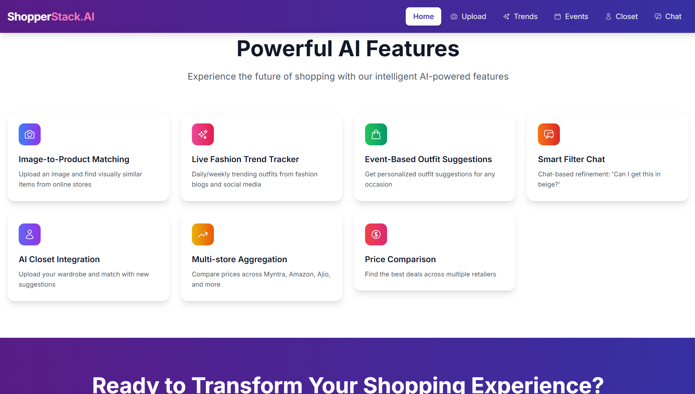

# ShopStack.ai
*AI-Powered Personal Shopper*

---

## About
ShopStack.ai helps users discover fashion items effortlessly. Simply describe what you're looking for:  

> "A maroon full-sleeve shirt under ₹1000 for a wedding"  

ShopStack understands your query, searches online stores, and suggests the best matches.

⚠️ **Note:** The project is currently under development, with the **backend AI and multi-store aggregation in progress**.

---

## Core Features
- **Natural Language Search** – Describe outfits in plain text  
- **AI-Powered Outfit Suggestions** – Personalized recommendations  
- **Image-Based Matching** – Find visually similar items  
- **Daily Fashion Feed** – Keep up with the latest trends  

---

## Feature Breakdown

| Feature | What It Does |
|---------|-------------|
| Image-to-Product Matching | Upload an image → find visually similar items from online stores |
| Live Fashion Trend Tracker | Daily/weekly trending outfits from blogs/social media |
| Event-Based Outfit Suggestions | Get outfit suggestions by occasion (fest, interview, etc.) |
| Smart Filter Chat | Chat-based refinement: “Can I get this in beige?” |
| AI Closet Integration | Upload your wardrobe → get personalized outfit suggestions and shopping recommendations |
| Use Case Suggestions | “Make me look taller” → LLM filters styles intelligently |
| Multi-store Aggregation + Price Comparison | Show products across Myntra, Amazon, Ajio, etc. Compare prices |

---

## Tech Stack / APIs

| Tool / API | Purpose |
|------------|---------|
| Gemini Vision | Process natural language descriptions into actionable queries |
| Gemini | Refines AI prompts for better recommendation results |
| Tavily API | Converts text queries into relevant product results |
| SerpApi | Fallback search engine results (Google/Bing) |
| Fast API (backend) | Handles image uploads and sends queries to the AI engine (under development) |
| React (frontend) | Displays image previews, product matches, and user interface components |
| Firebase | Cache product data or user searches for faster access |
| Pinecone | Vector database to store embeddings and retrieve exact or visually similar product matches efficiently |

---

## Screenshots (Prototype)

**Homepage:**  

**AI Features:**  

**Product Matching:**  

---

## Development Status
- **Backend AI and multi-store aggregation:** Under development  
- **Frontend:** Partially implemented, UI prototypes ready  
- Core AI query pipeline partially implemented  
- Improving recommendation logic and chat-based filters  

---

## Future Roadmap
- Complete AI recommendation engine  
- User accounts & personalized wardrobe integration  
- Mobile responsive design  
- Social media sharing & wishlist features  

---

## Contact
- GitHub: [Aniruddh-ui](https://github.com/Aniruddh-ui)  
- Email: aniruddhsb2005@gmail.com 

---

*Note: Screenshots and features shown are work-in-progress.*
